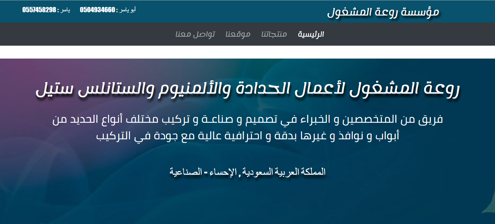
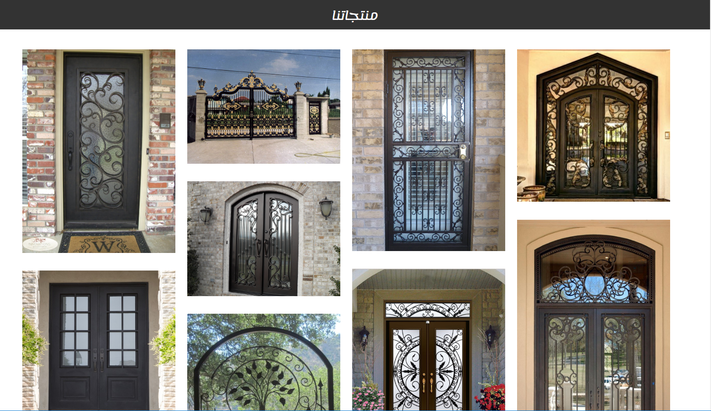
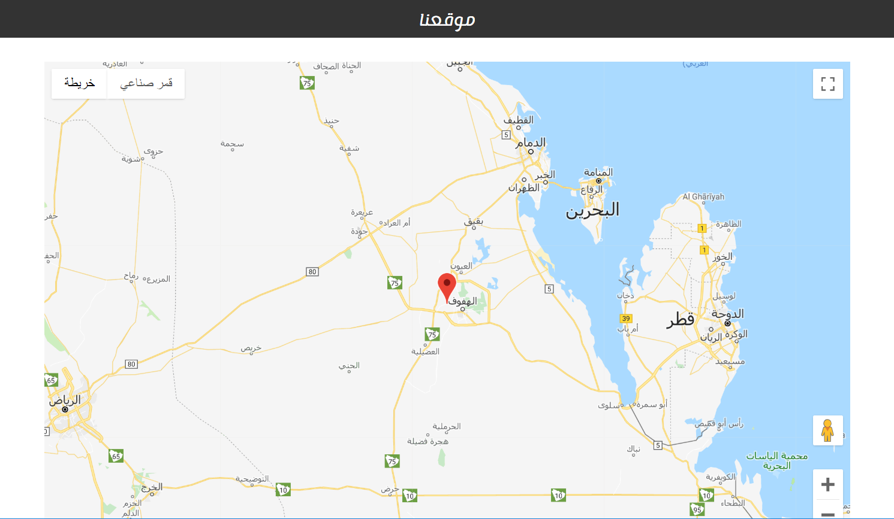
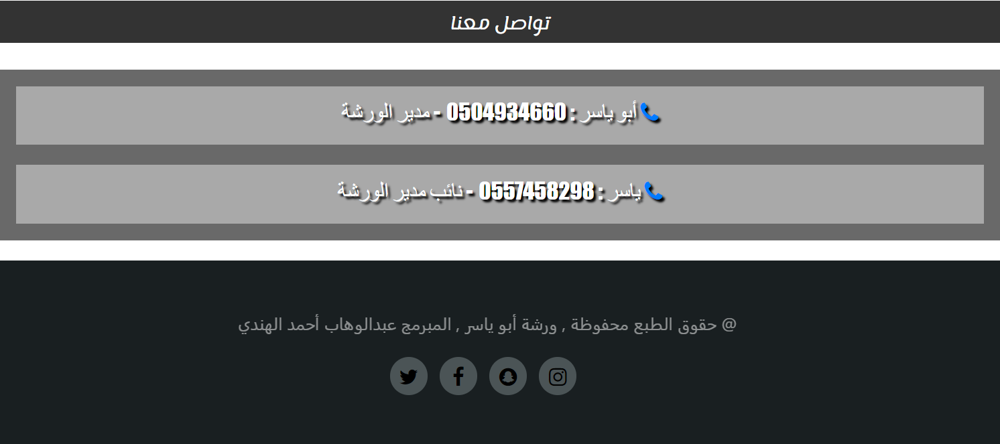

# Rawat-Almashgol-workshop-website
portfolio website for my uncle metal workshop

<h5># single page website that acts as a portfolio for my uncle metal workshop in which contains:</h5>
- workshop's name and motivation statement. 
- Image gallery for workshop's products. 
- workshop's location using google map API. 
- contact us. 

<h5># the website is responsive to any screen size.</h5>

<h5># Screenshots</h5>
  
  
  
  
  
 
